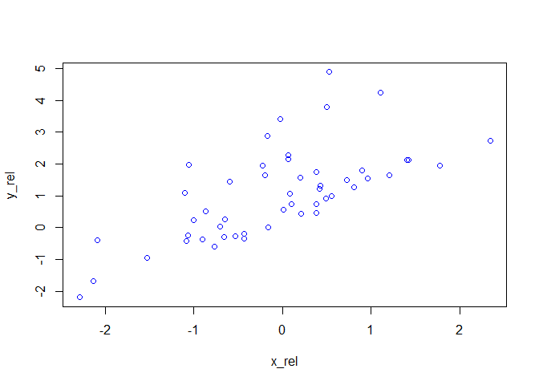

```r
x <- rexp(50)
y <- rnorm(50)

plot(x,y, col = "red")
```

<!-- -->

let's add some underneath relation 

```r
x_rel = rnorm(50)
y_rel = rexp(50) + x_rel

plot(x_rel,y_rel, col = "blue")
```

<!-- -->
